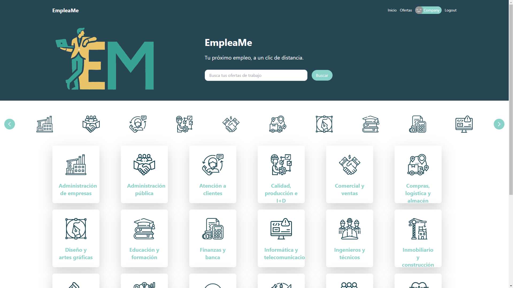
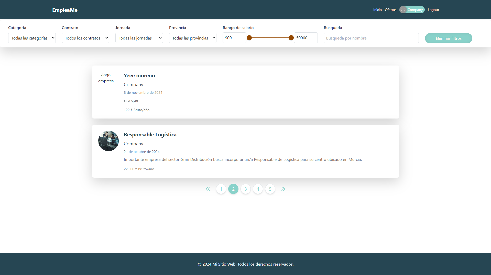
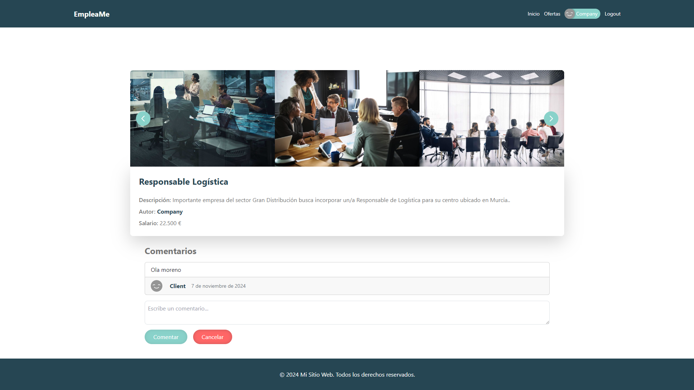
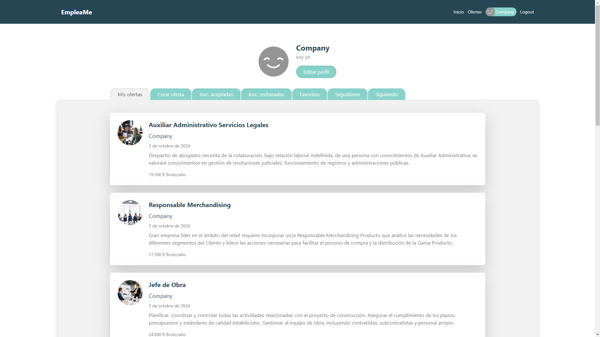
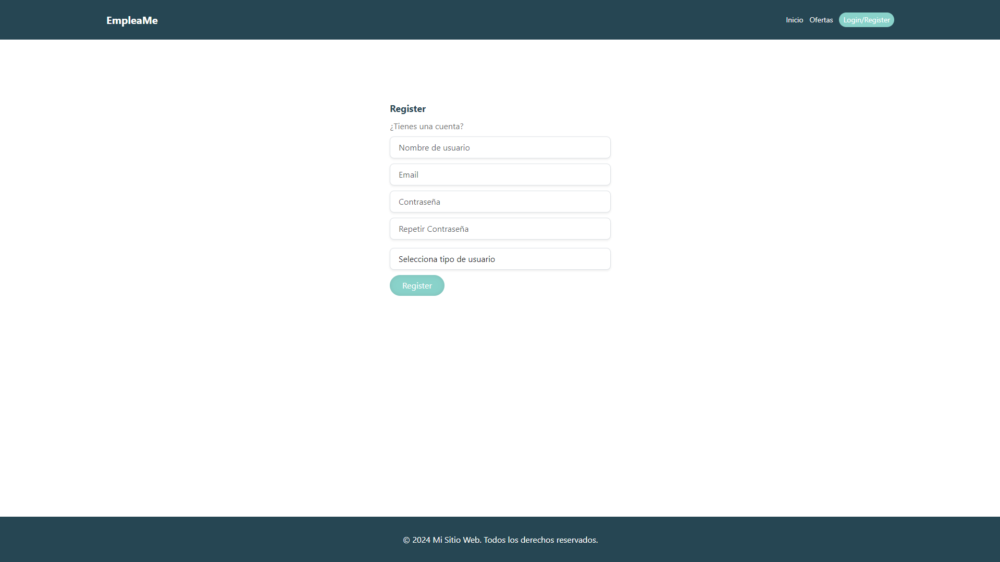
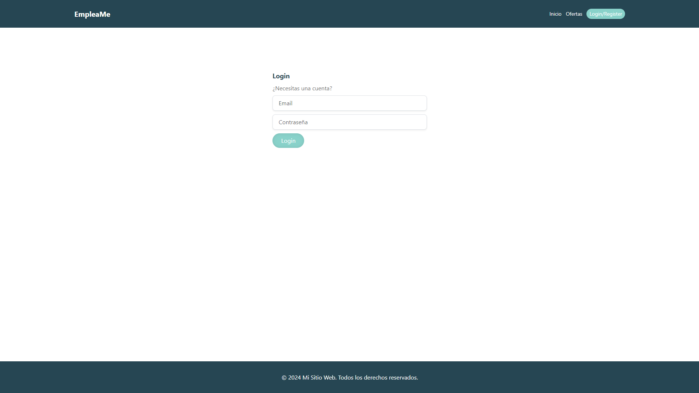

# EmpleaMe

EmpleaMe es un proyecto de clase desarrollado como una aplicación web de búsqueda de empleo. La aplicación permite a los usuarios buscar y postularse a empleos disponibles, además de gestionar sus perfiles como candidatos, empresas o administradores (recruiters) que verifican las inscripciones a una oferta.

## Tabla de Contenidos
- [Características](#características)
- [Tecnologías Utilizadas](#tecnologías-utilizadas)
- [Estructura del Proyecto](#estructura-del-proyecto)
- [Vistas del Proyecto](#vistas-del-proyecto)
- [Contribución](#contribución)

---

## Características

- **Búsqueda de empleos**: Filtros básicos como ubicación, categoría, salario, jornada, contrato o búsqueda por nombre.
- **Registro y autenticación**: Los usuarios pueden registrarse y autenticarse como candidatos (client), empresas (company) o administradores (recruiter).
- **Perfiles básicos**: Los candidatos pueden crear un perfil sencillo con información personal y profesional.
- **Panel para publicar empleos**: Las empresas pueden publicar y gestionar ofertas de empleo al igual que los administradores.

## Tecnologías Utilizadas

### Frontend

- **Angular**: Aplicación desarrollada en Angular StandAlone, encargada de la interfaz de usuario y las interacciones de todos los tipos de usuarios.

    

### Backend

1. **Node.js con Express y Mongoose**: Backend principal que gestiona los usuarios de tipo "cliente" (quienes buscan empleo) y todas las funcionalidades relacionadas con la búsqueda de empleos, gestión de perfiles de candidatos y acciones inherentes al tipo de usuario.

   

       
   

2. **Express con TypeScript y Prisma**: Backend secundario que se encarga de la creación de ofertas de empleo y las acciones realizadas por los usuarios de tipo "Company" (empresas).

   

       
   

3. **Fastify con TypeScript y TypeORM**: Backend que gestiona a los usuarios de tipo "Recruiter", quienes revisan y validan las inscripciones de empleo antes de enviarlas a las empresas (usuarios tipo "Company").
   
   - **Nota**: Fastify no tiene icono disponible. Este backend usa **TypeScript** y **TypeORM** además de **MongoDB**.
   
   

       
   

4. **Fastify con TypeScript** (con patrón Saga): Backend dedicado a gestionar el login y registro de todos los usuarios. Utiliza el patrón Saga para coordinar las transacciones y asegurar la coherencia en el proceso de autenticación.

   - **Nota**: Fastify no tiene icono disponible. Este backend usa **TypeScript**.

   

       
   

---

## Estructura del Proyecto

Aunque cada backend tiene una estructura única, todos siguen principios de **Clean Code** para mantener un código modular y fácil de entender.

- **Frontend (Angular)**: Contiene la aplicación standalone en Angular.
- **Backend**:
    - `backend-client`: Backend principal con Express y Mongoose.
    - `backend-company`: Backend con Express, TypeScript y Prisma.
    - `backend-recruiter`: Backend con Fastify, TypeScript y TypeORM.
    - `backend-auth`: Backend de autenticación con Fastify, TypeScript y el patrón Saga.

---

## Vistas del Proyecto

### Vista de Inicio (Home)

La vista de inicio es la página principal de **EmpleaMe**, diseñada para ser atractiva y fácil de navegar. Su función principal es facilitar el acceso a las diferentes categorías de empleo y permitir a los usuarios realizar búsquedas de ofertas específicas.

- **Encabezado**: Incluye el logo de EmpleaMe y una barra de navegación.
- **Eslogan y Barra de Búsqueda**: Muestra el eslogan y una barra de búsqueda para encontrar empleos por palabra clave.
- **Categorías de Empleo**: Iconos y categorías que representan sectores profesionales.
- **Navegación de Categorías**: Flechas de navegación para desplazarse entre categorías.

  
  
### Vista de Ofertas

La vista de **Ofertas** permite a los usuarios explorar y filtrar empleos disponibles según distintos criterios.

- **Filtros de Búsqueda**: Opciones para filtrar por categoría, contrato, jornada, provincia, rango de salario y búsqueda por nombre.
- **Listado de Ofertas**: Tarjetas con información de cada oferta, como título del puesto, empresa, fecha y salario.
- **Paginación**: Navegación entre páginas de resultados.

### Vista de Detalles de una Oferta

La vista de **Detalles de una Oferta** permite a los usuarios ver toda la información de una oferta específica.

- **Galería de Imágenes**: Carrusel de imágenes relacionadas con la oferta.
- **Información de la Oferta**: Título del puesto, descripción, autor y salario.
- **Sección de Comentarios**: Los usuarios pueden comentar e interactuar sobre la oferta.

### Vista de Perfil

La vista de **Perfil** permite a las empresas gestionar su información y acceder a funcionalidades relacionadas con sus ofertas y candidatos.

- **Información del Usuario**: Muestra el avatar, nombre de la empresa y botón de edición de perfil.
- **Navegación de Opciones**: Pestañas para gestionar ofertas, inscripciones y seguidores.
- **Listado de Ofertas Publicadas**: Detalles de cada oferta publicada por la empresa.
- **Información de las inscripciones**: Detalles sobre el estado de cada postulación de cada candidato.

### Vista de Registro

La vista de **Registro** permite a los nuevos usuarios crear una cuenta en la plataforma.

- **Formulario de Registro**: Campos para nombre de usuario, email, contraseña y tipo de usuario.
- **Botón de Registro**: Envía los datos para crear la cuenta.

  
### Vista de Login

La vista de **Login** permite a los usuarios existentes acceder a su cuenta en **EmpleaMe**.

- **Formulario de Inicio de Sesión**: Campos para email y contraseña.
- **Botón de Login**: Inicia sesión en la plataforma.
- **Enlace para Registro**: Mensaje para usuarios que aún no tienen una cuenta.

---

## Contribución

Este proyecto ha sido realizado en conjunto por [Paco Montés](https://github.com/fmontesdev) y por [Diego Llorens](https://github.com/Llorens19).
